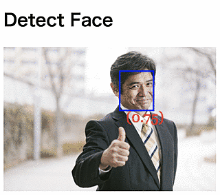
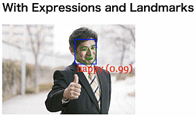

**This package has not been maintained for a long time.**

**Please use it by copying the code.**

---

# NgxFaceApiJs

[](https://travis-ci.com/kamiazya/ngx-face-api-js) [](https://codecov.io/gh/kamiazya/ngx-face-api-js) [](https://www.codefactor.io/repository/github/kamiazya/ngx-face-api-js) [](https://codeclimate.com/github/kamiazya/ngx-face-api-js/maintainability) [](https://bettercodehub.com/) [](https://app.fossa.io/projects/git%2Bgithub.com%2Fkamiazya%2Fngx-face-api-js?ref=badge_shield) [](https://opensource.org/licenses/MIT) [](https://badge.fury.io/js/ngx-face-api-js) [](https://github.com/prettier/prettier)

Angular directives for face detection and face recognition in the browser.

It is a wrapper for [face-api.js](https://github.com/justadudewhohacks/face-api.js), so it is not dependent on the browser implementation.

[](https://nodei.co/npm/ngx-face-api-js/)

## Description

Make face and emotion recognition features easy to use in Angular projects by using [face-api.js](https://github.com/justadudewhohacks/face-api.js).

- **Recognize faces, emotions** and so on in Angular project.
- **Works in a Mobile**.
- **No Script/Styles reqired**, you only embed attribute to img/video tag.
- **Schematics Support**, you can quickly set up a project using the `ng add` and `ng update` command.

### How it works?

Overlay canvas on img tag with embedded attributes such as singleFace and allFaces by using [Angular CDK Overlay](https://material.angular.io/cdk/overlay/overview).


And render the recognition result on canvas according to the content of the with attribute.

### Background

- [face-api.js](https://github.com/justadudewhohacks/face-api.js)
- [TensorFlow.js](https://github.com/tensorflow/tfjs-core)

## Demo

- [Detect Faces by Image -- StackBlitz](https://ngx-face-api-js-demo.stackblitz.io)([Editor](https://stackblitz.com/edit/ngx-face-api-js-demo?embed=1&file=src/app/app.component.html))

## Usage

### Detect All Faces

```html

```



### Detect Face With Expressions and Landmarks

```html

```



## Installation

### By `ng-add` Schematics

```bash
$ ng add ngx-face-api-js
...
UPDATE package.json (1457 bytes)
UPDATE src/styles.css (126 bytes)
UPDATE src/app/app.module.ts (497 bytes)
```

### By Manual

See [Wiki](https://github.com/kamiazya/ngx-face-api-js/wiki/Manual-Installation).

## Update

### By `ng-update` Schematics

```bash
$ ng update ngx-face-api-js
✅️ Added dependency: face-api.js@~0.20.0
✅️ Dependencies installed
UPDATE package.json (1440 bytes)
```

## Documantation

- [compodoc](https://kamiazya.github.io/ngx-face-api-js/)

## License

This software is released under the MIT License, see LICENSE.

[](https://app.fossa.io/projects/git%2Bgithub.com%2Fkamiazya%2Fngx-face-api-js?ref=badge_large)

## Author

[kamiazya(Yuki Yamazaki)](https://github.com/kamiazya)

[](https://ko-fi.com/W7W5VDNO)
